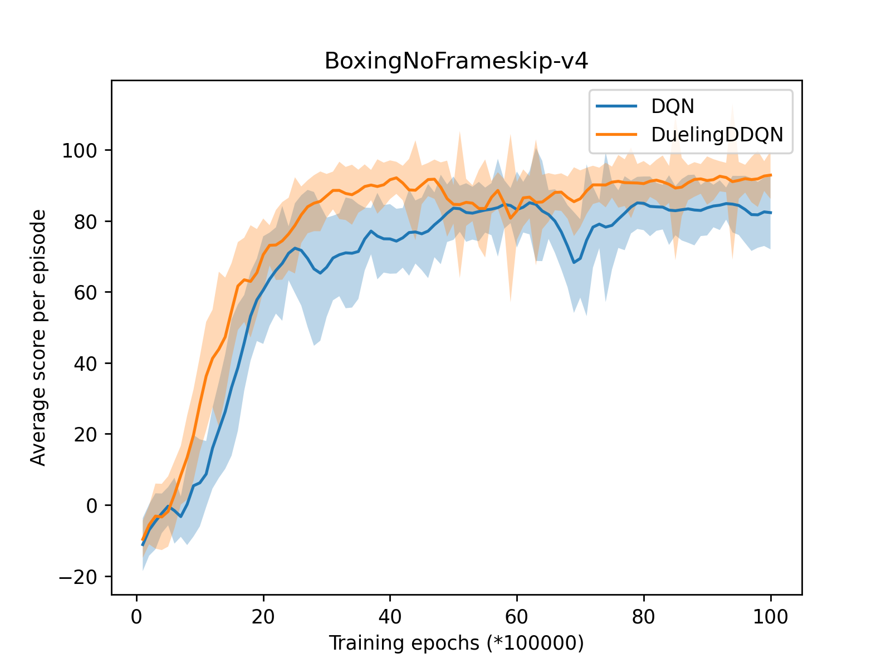
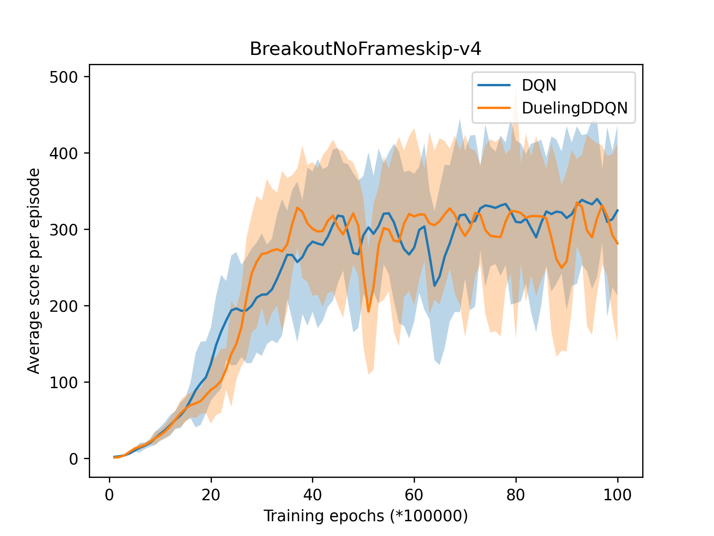
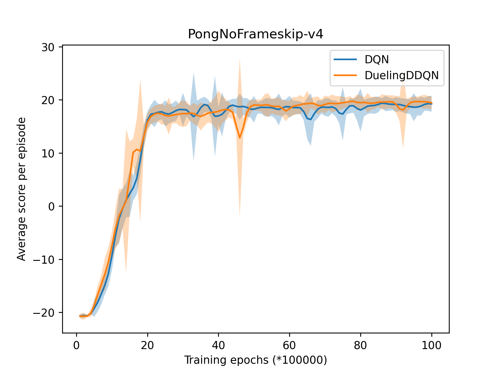
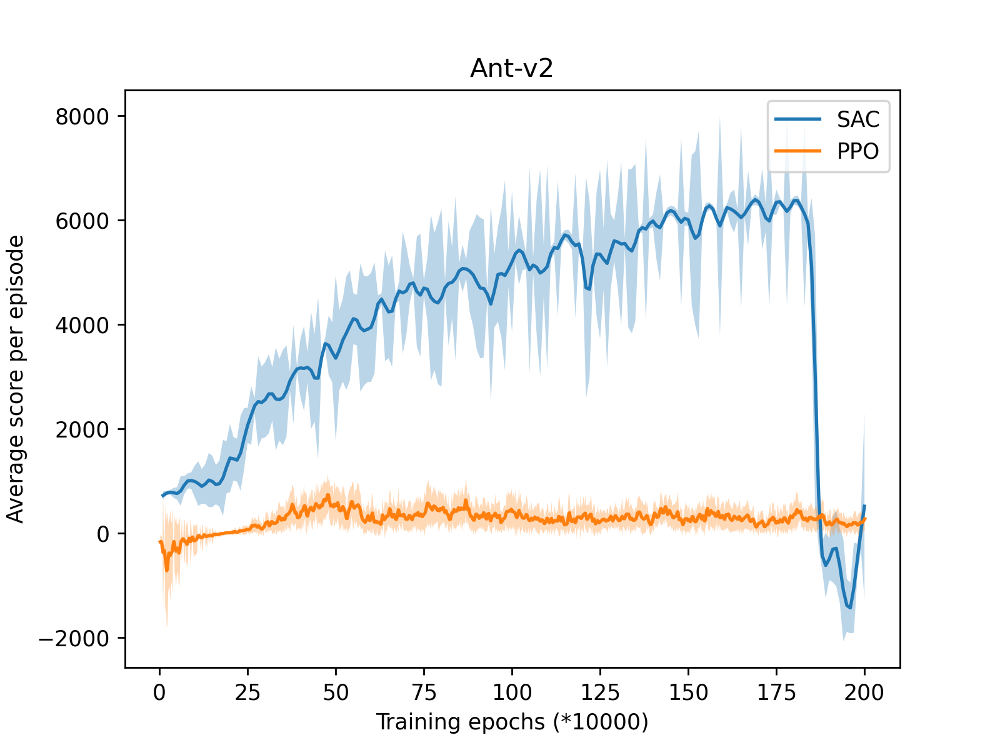
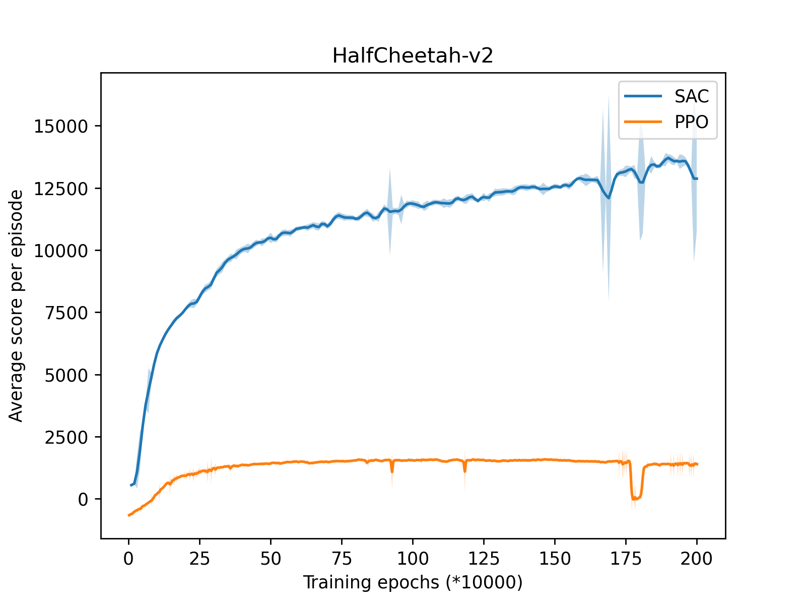
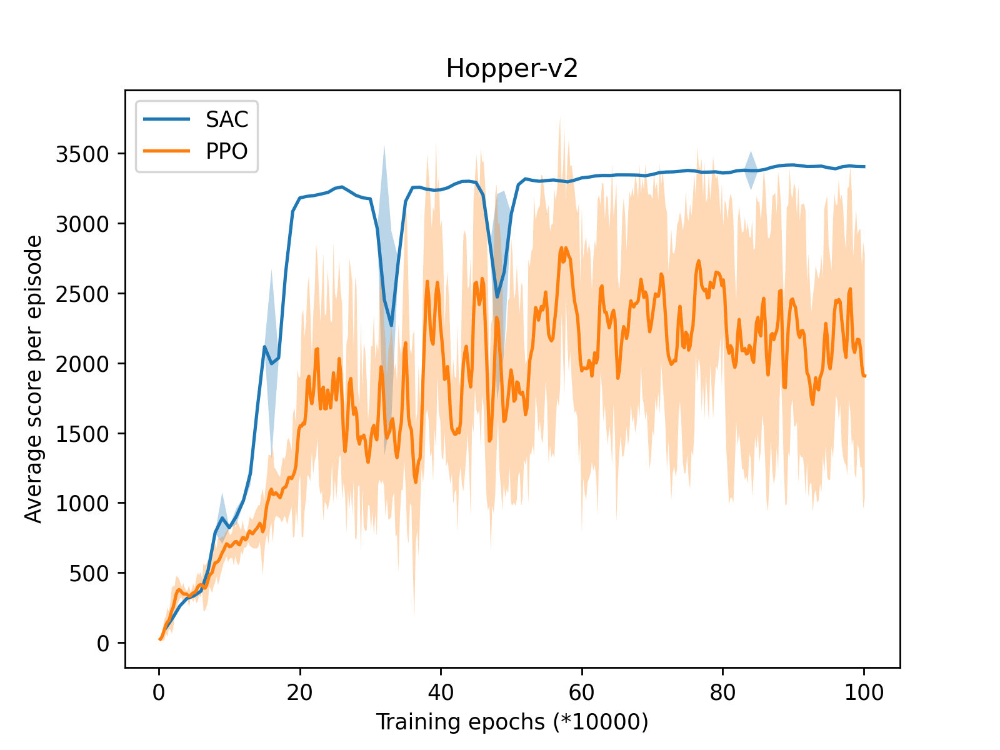
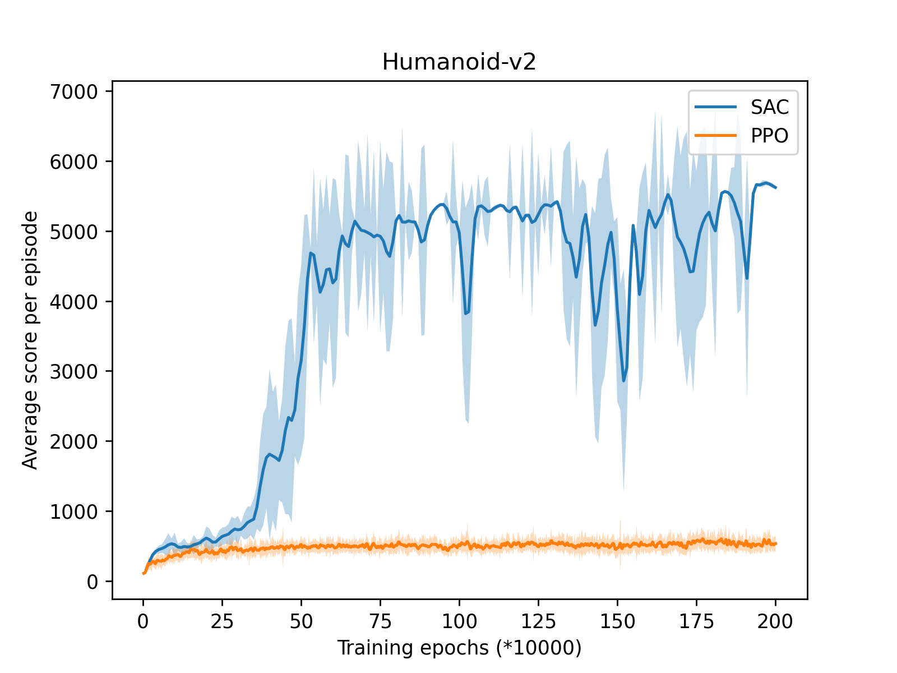

# Reinforcement Learning Final Project

## Structure

```shell
RL_final
├── atari
│   ├── atari_wrappers.py
│   ├── main.py
│   ├── memory.py
│   └── models.py
├── mujoco
│   ├── agent.py
│   ├── main.py
│   ├── memory.py
│   └── models.py
├── pic
│   ├── Ant.png
│   ├── Boxing.png
│   ├── Breakout.png
│   ├── HalfCheetah.png
│   ├── Hopper.png
│   ├── Humanoid.png
│   └── Pong.png
├── README.md
└── RL_final.pdf
```

## Usage

For value-based algorithm in atari

```shell
python3 main.py --env_name BreakoutNoFrameskip-v4 --is_dueling True --is_double True
```

For policy-based algorithm in mujoco

```shell
python3 main.py --env_name Hopper-v2 --method SAC
```

## Results

### Atari

<figure class="third">                </figure>

### Mujoco


